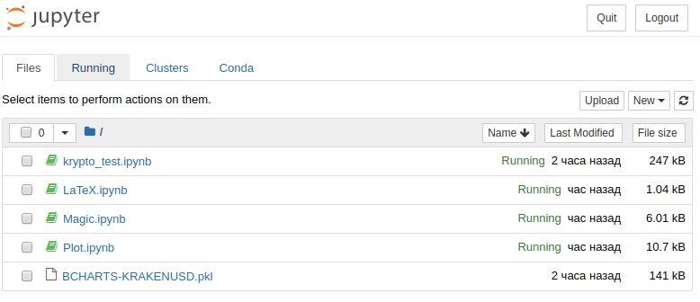
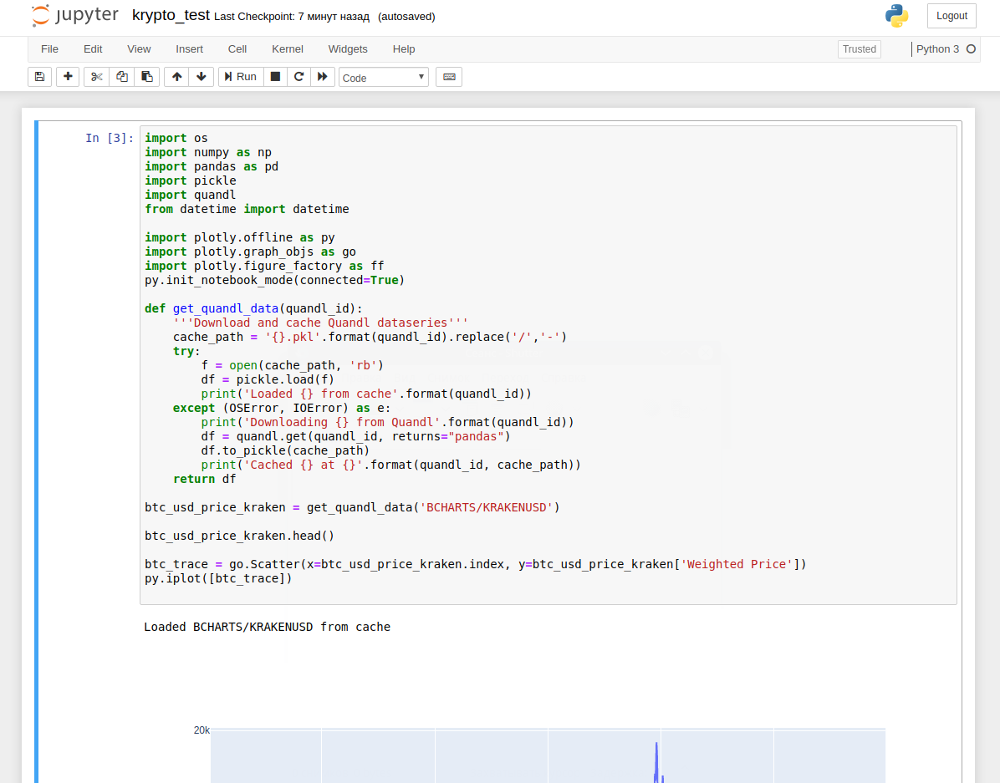
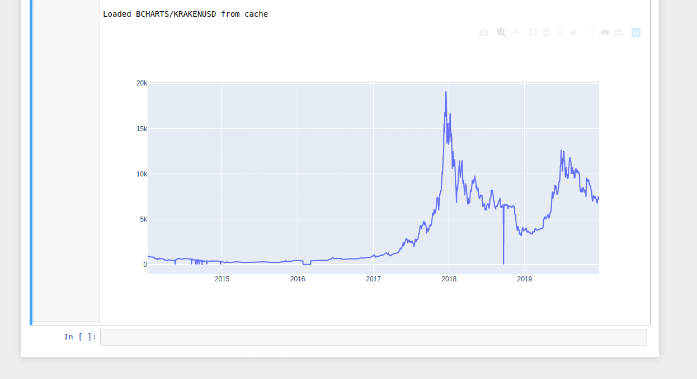
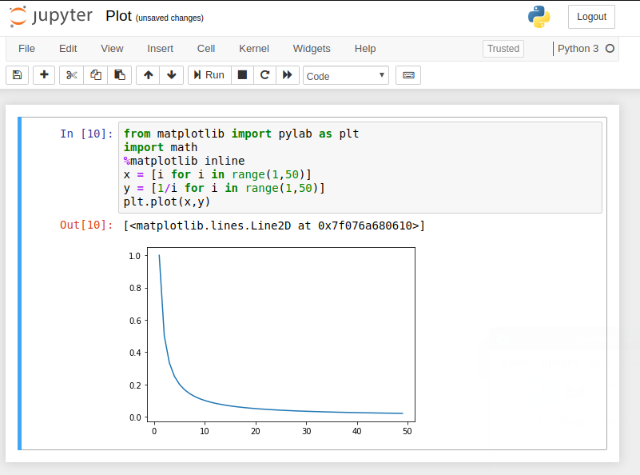
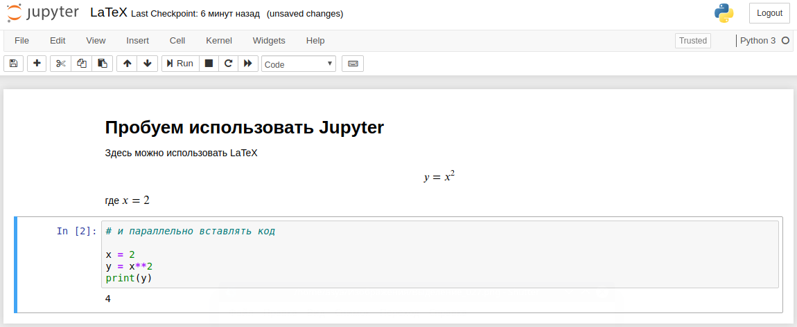
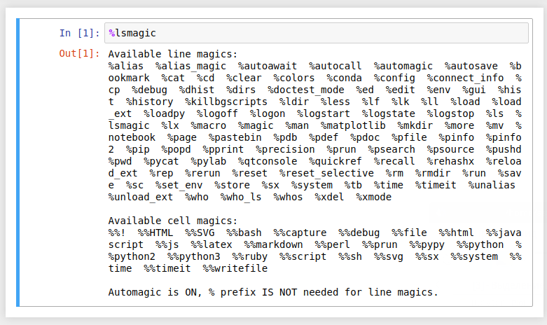

# Вариативная СР №1
## Задание 1.1
**Постановка задачи:** 
Создание ЭОР на тему «Использование платформы IPython для решения научных и исследовательских задач»


### Что такое IPython?
Цитата с сайта [devpractice.ru](https://devpractice.ru/python-lesson-6-work-in-jupyter-notebook/)
> IPython представляет собой мощный инструмент для работы с языком Python. Базовые компоненты IPython – это интерактивная оболочка для с широким набором возможностей и ядро для Jupyter. Jupyter notebook является графической веб-оболочкой для IPython, которая расширяет идею консольного подхода к интерактивным вычислениям.

IPython находится в составе Anaconda, и поэтому для его использования необходимо иметь установленную Anaconda.  

Запуск данного инструмента можно осуществлять с помощью команды  
```Bash
$ jupyter notebook
```
Таким образом запускается локальный сервер, зайти на который можно по адресу [localhost:8888](localhost:8888).  
Перед нами откроется интерактивная страничка, в которой мы и можем начать работать.



Нажав на кнопку New -> Python 3 мы создадим новую запись. В ней мы можем запускать код на Python.  
Вводить его нужно в ячейки.


Запускать код можно, нажав на кнопку с изображением стрелки или нажав сочетание клавиш Ctrl+Enter.

*Пример запущенного кода*

*График с помощью plotly*

*Или matplotlib.*  
*Примечание: чтобы график вывелся в записи, необходимо написать строку:*  
```python
%matplotlib inline
```


Также Jupyter позволяет верстать странички на языке разметки Markdown, используя при этом LaTeX:


Для того чтобы писать на Md нужно в панели инструментов выставить свойство "Markdown".


Последним хочется отметить "Магию" в JN. Магия - это дополнительные команды, выполняемые в рамках оболочки, которые облегчают процесс разработки.
Список команд можно вывести командой  
```Bash
%lsmagic
```


Информацию по ним можно найти [здесь](https://ipython.org/ipython-doc/3/interactive/magics.html) и [здесь](https://www.dataquest.io/blog/jupyter-notebook-tips-tricks-shortcuts/).

Записи с гайдами по JN есть [здесь](https://github.com/jupyter/jupyter/wiki/A-gallery-of-interesting-Jupyter-and-IPython-Notebooks).